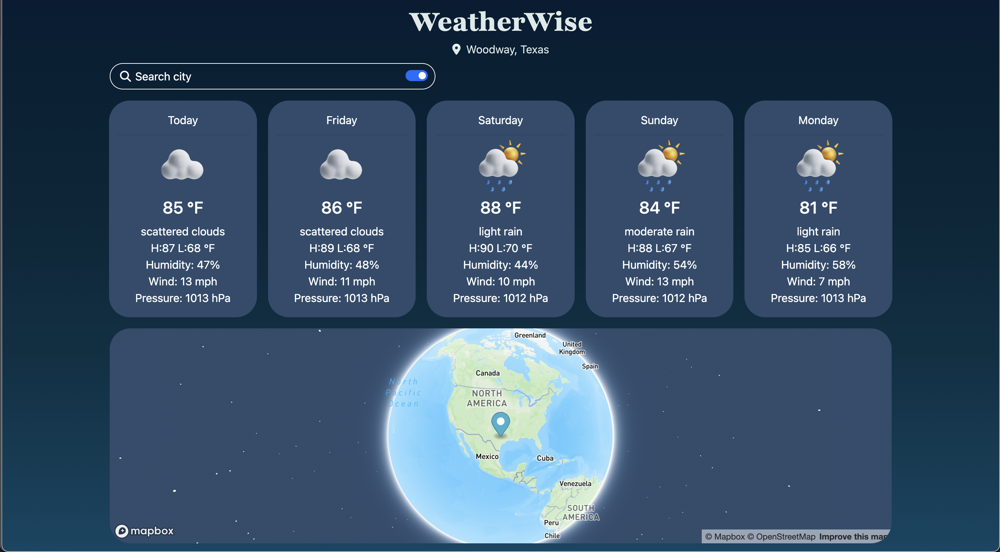

# Weather Map Application

## Overview

This application is a user-friendly, interactive web application that displays current weather information and a five-day forecast for any location in the world. It's powered by OpenWeatherMap's API for weather data and the Mapbox API for geolocation services.

## Features

- **Current Weather Information**: The application displays detailed current weather information including temperature, humidity, wind speed, and description of the weather.

- **Five-Day Forecast**: The application provides a five-day forecast for the chosen location, offering key insights into future weather patterns.

- **Interactive Map**: Users can interact with an embedded map to choose their location. They can also search for a location using the built-in search functionality.

- **Location Search**: A search bar allows for quick navigation to any location in the world, dynamically updating the weather information.

- **Responsive Design**: The application is fully responsive and can be used across different device sizes.

## Tech Stack

- HTML5
- CSS3
- JavaScript (ES6+)
- jQuery
- AJAX
- OpenWeatherMap API
- Mapbox API

## Code Highlights

- Asynchronous JavaScript and XML (AJAX) to retrieve and update weather data in real time.
- Use of JavaScript's geolocation capabilities along with Mapbox's geocoding API for precise location services.
- An interactive user interface created with HTML5, CSS3, and jQuery.

## Live Demo

Experience the live demo of the application at this link: [Live Demo](link-to-live-demo-of-your-project)
